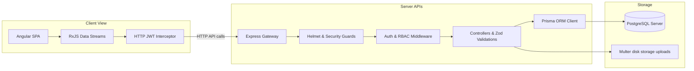

# System Architecture – SkillSphere

SkillSphere is built on a modern decoupling monorepo architecture leveraging Angular SPA for views and Node.js/Express for backend APIs, with PostgreSQL running transactional data queries.

---

## Technical Stack Architecture

---

## Security & Authentication

### 1. Dual-Token Authentication Model
1. **Access Token (JWT)**:
   - Secret key: `JWT_ACCESS_SECRET`
   - Expiration: `15 minutes`
   - Injected in HTTP requests via authorization header `Bearer <token>`.
2. **Refresh Token (JWT)**:
   - Secret key: `JWT_REFRESH_SECRET`
   - Expiration: `7 days`
   - Handled via refresh rotation token families to prevent replay compromises. If a token is reused, the entire token family is wiped out in database for safety.

### 2. Guard Systems
- **RBAC Filters**: Middleware parses active role permissions (`SUPER_ADMIN`, `ADMIN_SUPPORT`, `MANAGER`, `EMPLOYEE`).
- **Resource Ownership**: Employees are forbidden from retrieving other staff records.
- **Team Scope Bounds**: Managers are restricted to their direct team subordinates list.

---

## Transaction & Error Pipelines

### 1. Database Isolation
Database queries are wrapped inside Prisma transaction loops (`prisma.$transaction`) to guarantee data integrity across dual updates (e.g. updating manager assignment and closing historical records in one block).

### 2. Logging Interceptors
- **Audit Logging**: Successful logins, employee edits, training allocations, and ticket resolutes write details to `AuditLog` in PostgreSQL.
- **Error Capture**: express global error middleware captures stack traces and parameters, masks password tokens, and inserts them to `ErrorLog` table.
