# Database Entity-Relationship Diagram – SkillSphere

The PostgreSQL database structure managed through Prisma ORM models.

```mermaid
erDiagram
    users ||--o{ refresh_tokens : owns
    users ||--o{ login_history : records
    users ||--o| notification_preferences : has
    users ||--o{ notifications : receives
    users ||--o{ saved_filters : saves
    users ||--o{ audit_logs : logs
    users ||--o{ error_logs : logs
    
    departments ||--o{ designations : has
    departments ||--o{ employees : has
    departments ||--o{ department_skill_requirements : requires
    
    designations ||--o{ employees : assigns
    designations ||--o{ role_skill_requirements : requires
    designations ||--o{ career_paths : transitions
    
    employees ||--o| users : associates
    employees ||--o{ manager_assignments : reports
    employees ||--o{ manager_assignment_history : reports
    employees ||--o{ employee_skills : acquires
    employees ||--o{ training_plans : conducts
    employees ||--o{ certificates : uploads
    employees ||--o{ employee_learning_paths : enrolls
    employees ||--o{ support_tickets : creates
    
    skills ||--o{ skill_dependencies : defines
    skills ||--o{ department_skill_requirements : tracks
    skills ||--o{ role_skill_requirements : tracks
    skills ||--o{ employee_skills : rates
    skills ||--o{ training_plans : aligns
    skills ||--o{ learning_path_items : builds
    
    employee_skills ||--o{ skill_rating_history : tracks
    
    training_plans ||--o{ training_progress_history : tracks
    training_plans ||--o{ training_comments : details
    training_plans ||--o{ certificates : issues
    
    support_tickets ||--o{ ticket_messages : displays
    support_tickets ||--o{ ticket_attachments : uploads
    support_tickets ||--o{ ticket_status_history : tracks
    support_tickets ||--o{ ticket_sla_history : checks
```

---

## Key Constraints Enforced in PostgreSQL

1. **Uniqueness**:
   - `User.email` must be unique.
   - `Employee.employeeCode` must be unique.
   - `Skill.skillCode` and `Skill.skillName` must be unique.
   - `SupportTicket.ticketNumber` must be unique.
2. **Ranges & Bounds**:
   - `selfRating` & `finalRating` ratings are bounded on a 1 to 5 scale in the controllers.
   - `progress` in training plans is clamped between 0 and 100%.
3. **Manager Capacities**:
   - Limit assignments count per manager to maximum 10 reports, which can be dynamically bypassed by admin overrides.
