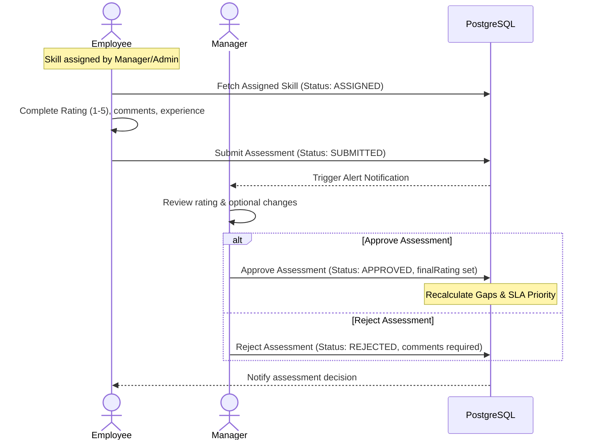
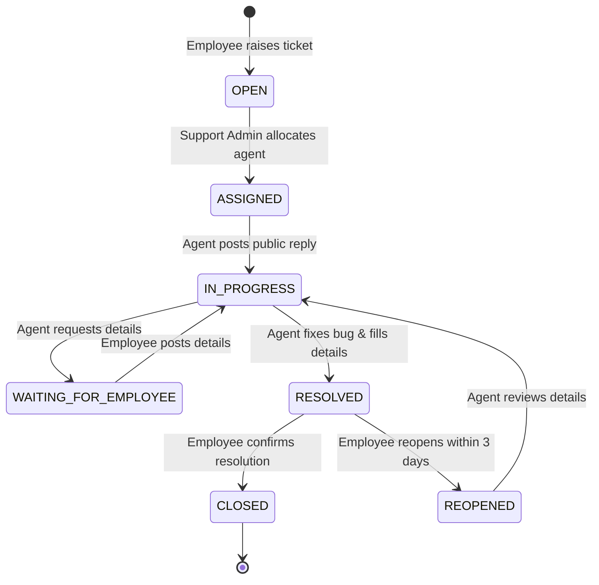

# Workflow Lifecycles – SkillSphere

Detailed processes for operations, assessments, and ticketing workflows.

---

## 1. Skill Assessment & Approval Workflow

- **Skill Gap Formula**: `Required Rating - Final Rating = Gap`
- **Gap Priorities**:
  - `Gap <= 0` -> No Gap
  - `Gap = 1` -> Low priority
  - `Gap = 2` -> Medium priority
  - `Gap >= 3` -> High priority (recommends training automatically)

---

## 2. Training Plan & Certificate Verification

1. **Assignment**: Admin or Manager assigns a training plan.
2. **Updates**: Employee initiates progress (Not Started to In Progress). Progress percentage updates (1% - 99%).
3. **Completion Request**: Employee slides progress to 100%, status becomes `SUBMITTED_FOR_REVIEW`. Employee uploads a certificate attachment.
4. **Verification**: Manager reviews the uploaded certificate. If details align, sets status to `VERIFIED`.

---

## 3. Helpdesk Support Tickets & SLA Workflow

- **SLA Timing Targets**:
  - `CRITICAL` -> 1 hour
  - `HIGH` -> 4 hours
  - `MEDIUM` -> 8 hours
  - `LOW` -> 24 hours
- If the ticket first response time exceeds these parameters, the cron job flags the SLA as `BREACHED` and triggers alerts.
